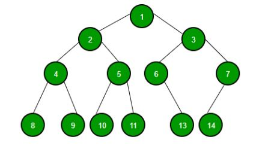
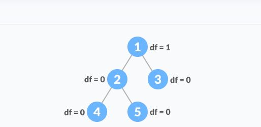
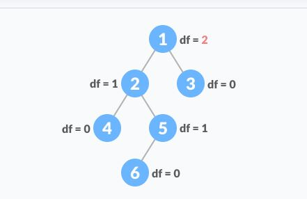

**Trees**

**Introduction**

A tree is a collection of nodes connected by directed (or undirected) edges. It is a nonlinear data structure, compared to arrays, linked lists, stacks and queues which are linear data structures. A tree can be empty with no nodes, or a tree is a structure consisting of one node called the root and zero or one or more subtrees.
We will be looking at binary trees, binary search trees, balanced binary search trees.

**Binary Trees** 

A tree whose elements have at most 2 children is called a binary tree. The children are named left and right children since each element can only have two children. A binary tree node contains three parts: Data, pointer to left child and pointer to right child.



**Binary Search Tree**
A Binary Search Tree is a node-based binary tree data structure which goes by the following rules:

- The left subtree of a node contains only nodes with keys lesser than the node’s key.
- The right subtree of a node contains only nodes with keys greater than the node’s key.
- The left and right subtree each must also be a binary search tree.


**Balanced Binary Search Tree**]
A balanced binary tree is also known as height balanced tree. It is defined as binary tree in when the difference between the height of the left subtree and right subtree is not more than m, where m is usually equal to 1. The height of a tree is the number of edges on the longest path between the root node and the leaf node.



This is a balanced binary search tree



This is an unbalanced binary search tree

**Tree Operations in python**
|Common BST Operations | Explanation | Performance|
|----------------------|-------------|------------|
|insert(value) |Inserts a value into the tree| O(logn)|
|remove(value) |Removes value from the tree| O(logn)|
|traverse_foward |Visit all objects from smallest to largest |O(logn)|
|traverse_reverse | Visit all objects from largest to smallest |O(logn)
|height(node)| Determines the height of the node| O(logn)|
|size() | Returns the size of the BST| O(1) |

**Problem to solve**
```python

class BST:
    """
    Implement the Binary Search Tree (BST) data structure.  The Node 
    class below is an inner class.  An inner class means that its real 
    name is related to the outer class.  To create a Node object, we will 
    need to specify BST.Node
    """

    class Node:
        """
        Each node of the BST will have data and links to the 
        left and right sub-tree. 
        """

        def __init__(self, data):
            """ 
            Initialize the node to the data provided.  Initially
            the links are unknown so they are set to None.
            """
       
            self.data = data
            self.left = None
            self.right = None

    def __init__(self):
        """
        Initialize an empty BST.
        """
        self.root = None

    def insert(self, data):
        """
        Insert 'data' into the BST.  If the BST
        is empty, then set the root equal to the new 
        node.  Otherwise, use _insert to recursively
        find the location to insert.
        """
        if self.root is None:
            self.root = BST.Node(data)
        else:
            self._insert(data, self.root)  # Start at the root

    ###################
    # Start Problem 1 #
    ###################
    def _insert(self, data, node):
        """
        This function will look for a place to insert a node
        with 'data' inside of it.  The current sub-tree is
        represented by 'node'.  This function is intended to be
        called the first time by the insert function.
        """
        if data < node.data:
            # The data belongs on the left side.
            if node.left is None:
                # We found an empty spot
                node.left = BST.Node(data)
            else:
                # Need to keep looking.  Call _insert
                # recursively on the left sub-tree.
                self._insert(data, node.left)
        else:
            # The data belongs on the right side.
            if node.right is None:
                # We found an empty spot
                node.right = BST.Node(data)
            else:
                # Need to keep looking.  Call _insert
                # recursively on the right sub-tree.
                self._insert(data, node.right)
    
    #################
    # End Problem 1 #
    #################

    def __contains__(self, data):
        """ 
        Checks if data is in the BST.  This function
        supports the ability to use the 'in' keyword:

        if 5 in my_bst:
            ("5 is in the bst")

        """
        return self._contains(data, self.root)  # Start at the root

    ###################
    # Start Problem 2 #
    ###################
    def _contains(self, data, node):
        """
        This function will search for a node that contains
        'data'.  The current sub-tree being search is 
        represented by 'node'.  This function is intended
        to be called the first time by the __contains__ function.
        """
        if node is None:
            return False
        else:
            if data == node.data:
                return True
            elif data < node.data:
                return self._contains(data, node.left)
            else:
                return self._contains(data, node.right)
    #################
    # End Problem 2 #
    #################

    def __iter__(self):
        """
        Perform a forward traversal (in order traversal) starting from 
        the root of the BST.  This is called a generator function.
        This function is called when a loop is performed:

        for value in my_bst:
            print(value)

        """
        yield from self._traverse_forward(self.root)  # Start at the root
        
    def _traverse_forward(self, node):
        """
        Does a forward traversal (in-order traversal) through the 
        BST.  If the node that we are given (which is the current
        sub-tree) exists, then we will keep traversing on the left
        side (thus getting the smaller numbers first), then we will 
        provide the data in the current node, and finally we will 
        traverse on the right side (thus getting the larger numbers last).

        The use of the 'yield' will allow this function to support loops
        like:

        for value in my_bst:
            print(value)

        The keyword 'yield' will return the value for the 'for' loop to
        use.  When the 'for' loop wants to get the next value, the code in
        this function will start back up where the last 'yield' returned a 
        value.  The keyword 'yield from' is used when our generator function
        needs to call another function for which a `yield` will be called.  
        In other words, the `yield` is delegated by the generator function
        to another function.

        This function is intended to be called the first time by 
        the __iter__ function.
        """
        if node is not None:
            yield from self._traverse_forward(node.left)
            yield node.data
            yield from self._traverse_forward(node.right)
        
    def __reversed__(self):
        """
        Perform a forward traversal (in order traversal) starting from 
        the root of the BST.  This function is called when a the 
        reversed function is called and is frequently used with a for
        loop.

        for value in reversed(my_bst):
            print(value)

        """        
        yield from self._traverse_backward(self.root)  # Start at the root

    

# Sample Test Cases (may not be comprehensive) 
print("\n=========== PROBLEM 1 TESTS ===========")
tree = BST()
tree.insert(5)
tree.insert(3)
tree.insert(7)
# After implementing 'no duplicates' rule,
# this next insert will have no effect on the tree.
tree.insert(7)  
tree.insert(4)
tree.insert(10)
tree.insert(1)
tree.insert(6)
for x in tree:
    print(x)  # 1, 3, 4, 5, 6, 7, 10

print("\n=========== PROBLEM 2 TESTS ===========")
print(3 in tree) # True
print(2 in tree) # False
print(7 in tree) # True
print(6 in tree) # True
print(9 in tree) # False

```

Take a look at the [solution](treessolution.py) when you are done.


